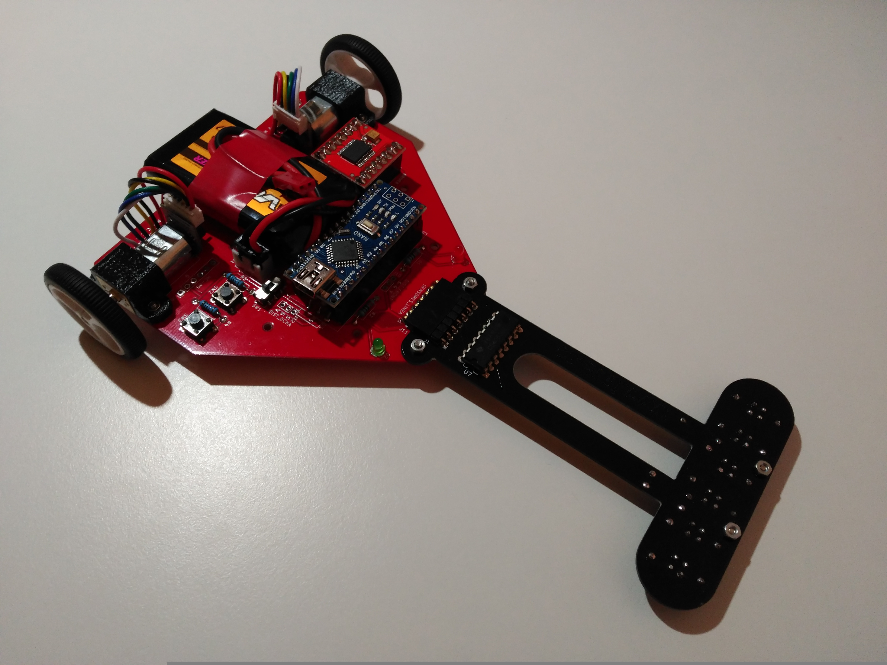

# Cyclops-project

Robot de carreras open source con cámara, diseñado para la [Liga Nacional de Robótica de Competición](http://lnrc.es/).

## Autor

[Rubén Espino San José](https://github.com/Resaj)

## Licencia

Todos estos productos están liberados mediante [Creative Commons Attribution-ShareAlike 4.0 International License](http://creativecommons.org/licenses/by-sa/4.0/).  

_All these products are released under [Creative Commons Attribution-ShareAlike 4.0 International License](http://creativecommons.org/licenses/by-sa/4.0/)._
