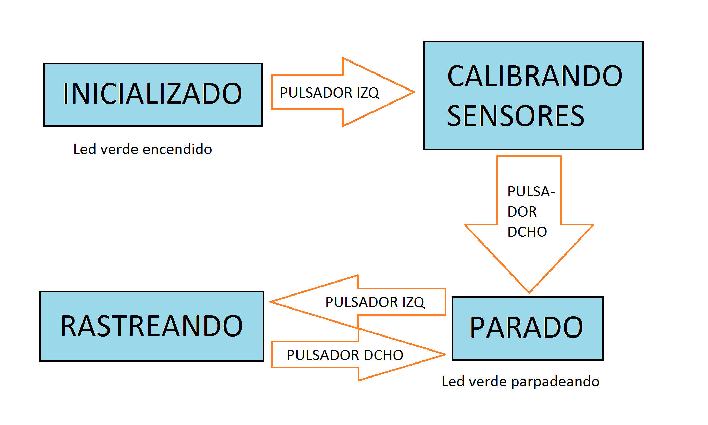

# Programa PID_seguimiento_linea

Este programa sirve para testear el funcionamiento de un algoritmo PID básico para el seguimiento de líneas con el robot.

Por defecto, el programa sigue la línea con los sensores de optorreflectancia, pero puede seguirla con la cámara si se descomenta la siguiente línea al comienzo del programa:

``` #define SEGUIMIENTO_CON_CAMARA ```

Para controlarlo se emplea la siguiente máquina de estados:

<p align="center">

</p>

y los siguientes caracteres, que se envían como comandos a través de bluetooth o USB:
- '0' -> Parar (muy útil para parada de emergencia cuando se escapa el robot)
- '-' -> Bajar velocidad
- '+' -> Subir velocidad
- '1' -> Bajar Kp
- '7' -> Subir Kp
- '2' -> Bajar Ki
- '8' -> Subir Ki
- '3' -> Bajar Kd
- '9' -> Subir Kd

El led rojo indica que la batería está baja.

El led verde puede indicar lo siguiente:
- Si es fijo, se encuentra en el estado "INICIALIZADO".
- Si se enciende y se queda fijo mientras se encuentra en el estado "CALIBRANDO_SENSORES", quiere decir que los umbrales son aceptables y hay margen para una lectura correcta de la línea.
- Si parpadea, se encuentra en el estado "PARADO", preparado para correr.

Hay que tener en cuenta que, en el estado "CALIBRANDO_SENSORES", hay que mover el robot sobre la línea para que los sensores tomen los valores mínimos y máximos para poder calcular un umbral adecuado entre blanco y negro. Pulsar entonces el pulsador derecho para pasar al estado "PARADO". Es posible que al calibrar la cámara en este punto no se encienda el led verde porque los umbrales de blanco y negro son muy próximos entre ellos. El potenciómetro trasero de la cámara ajusta la ganancia de salida, modificando los valores de blanco y negro, pero aún así es difícil conseguir un buen resultado.

# Programa PID_seguimiento_linea_PIDfromBT

Una variante de PID_seguimiento_linea es el programa que puede encontrarse en la carpeta "PID_seguimiento_linea_PIDfromBT", adaptado por OPRobots para controlar el robot mediante su App para móvil, [PIDfromBT](https://github.com/robotaleh/PIDfromBT). La funcionalidad es la misma, pero el control puede realizarse desde el móvil.

Antes de cargarlo hay que instalar previamente su librería [PIDfromBTlib](https://github.com/robotaleh/PIDfromBTlib).
