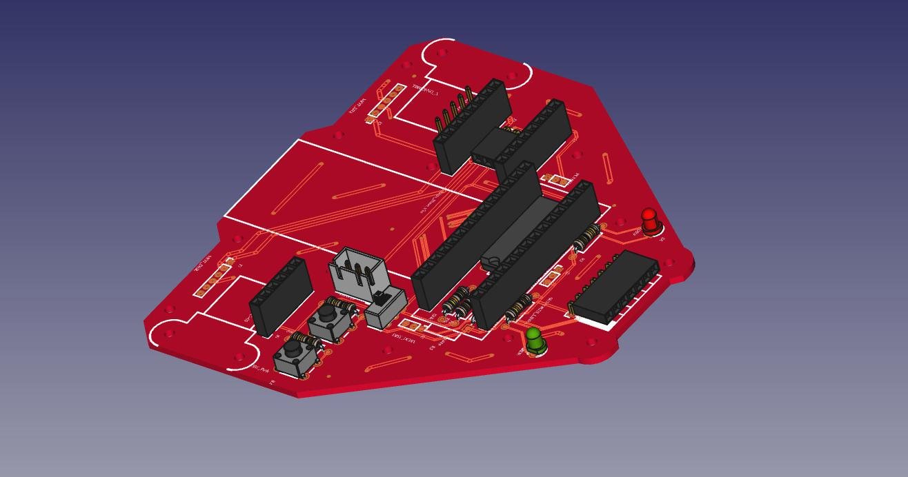
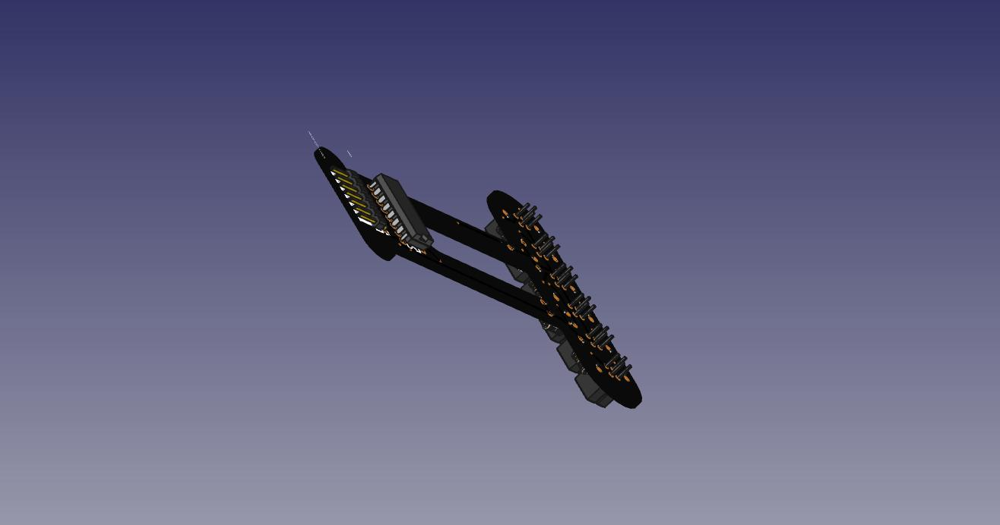

# Diseño FreeCad de las PCB de Cyclops

El diseño de las placas se ha ralizado partiendo del diseño en kiCad usando el banco de trabajo de FreeCad - [Printed Circuit Board](https://sourceforge.net/projects/eaglepcb2freecad/), tal y como se cuenta en este [tutorial](http://diwo.bq.com/creando-los-modelos-3d-de-nuestros-circuitos-con-freecad/).

Algunos de los componentes no existian en la base original de la herramienta, por lo que se han utilizado de repositorio de [FreeCad](https://github.com/FreeCAD/FreeCAD-library)

